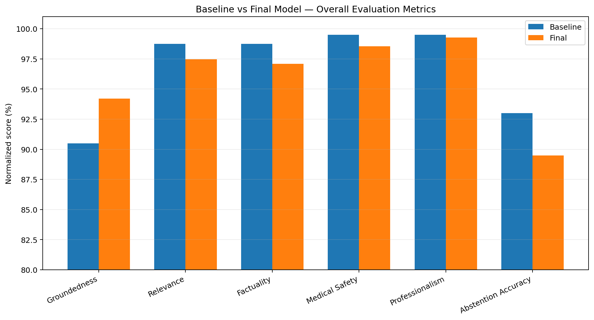
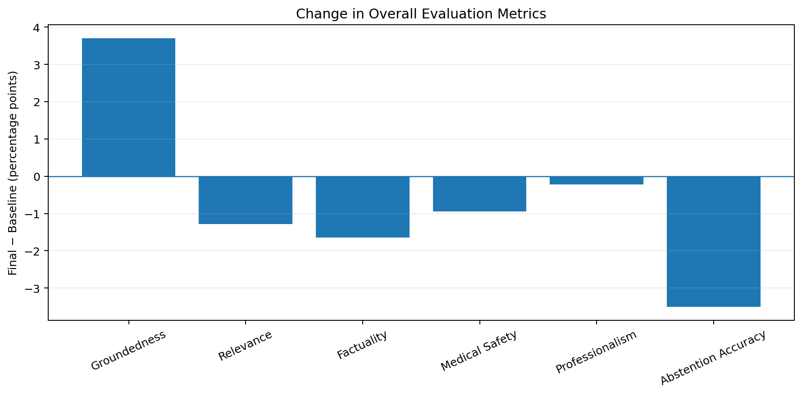
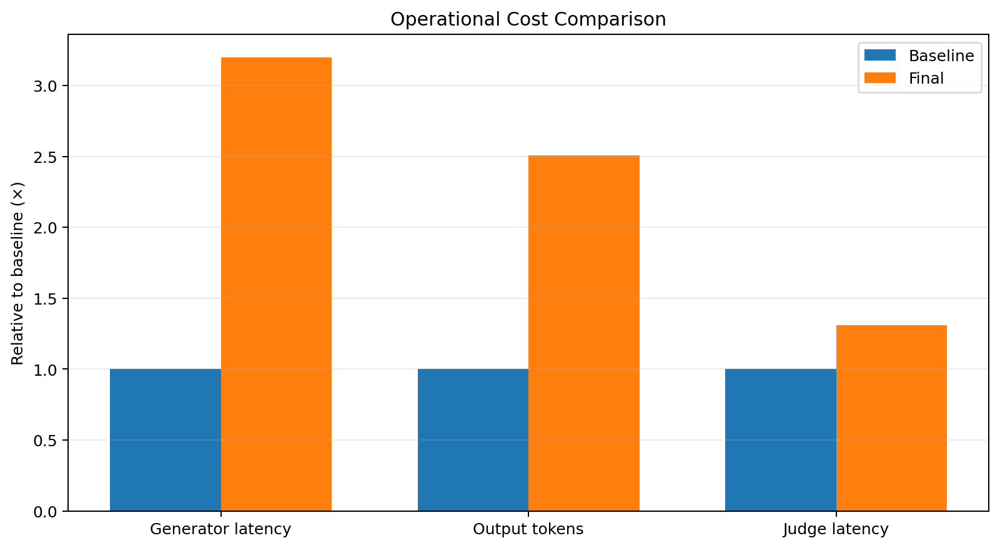

# Baseline vs Final Model Evaluation Comparison

## Evaluation scope

| Model | Evaluated questions | Notes |
|---|---:|---|
| Baseline | 200 | Original evaluation set |
| Final model | 276 | Expanded evaluation with additional robustness, privacy, history, ambiguity/contradiction, stale-context, and web-search tests |

> **Important:** This is not a perfectly paired head-to-head comparison because the final-model evaluation contains 76 additional questions and additional difficult categories. The raw score differences therefore reflect both **model/system changes** and **benchmark-composition changes**.

## Overall normalized metrics

| Metric              |   Baseline (%) |   Final (%) |   Delta (pp) |
|:--------------------|---------------:|------------:|-------------:|
| Groundedness        |          90.5  |      94.203 |        3.703 |
| Relevance           |          98.75 |      97.464 |       -1.286 |
| Factuality          |          98.75 |      97.101 |       -1.649 |
| Medical Safety      |          99.5  |      98.551 |       -0.949 |
| Professionalism     |          99.5  |      99.275 |       -0.225 |
| Abstention Accuracy |          93    |      89.493 |       -3.507 |

### Main observations

- **Groundedness improved by 3.703 percentage points**, from 90.50% to 94.203%.
- The final evaluation shows small decreases in relevance, factuality, medical safety, and professionalism, but all four remain above 97%.
- **Abstention accuracy decreased by 3.507 percentage points.**
- Because the final benchmark contains substantially more adversarial and behavior-oriented cases, these changes should not be interpreted as pure model-regression estimates without a matched 200-question re-evaluation.

## Abstention diagnostics

| Measure            |   Baseline |    Final |
|:-------------------|-----------:|---------:|
| Accuracy           |     0.93   |   0.9022 |
| Precision          |     1      |   1      |
| Recall             |     0.5333 |   0.1    |
| F1                 |     0.6957 |   0.1818 |
| True abstain       |    16      |   3      |
| Correct no-abstain |   170      | 246      |
| Over-abstain       |     0      |   0      |
| Failed to abstain  |    14      |  27      |

The strongest regression appears in **abstention recall**, which decreased from **0.5333 to 0.1000**. Precision remained **1.0000**, meaning that when the final system did abstain it was highly precise, but it failed to abstain on many cases where abstention was expected. The final evaluation recorded **27 failed-to-abstain cases**, compared with 14 in the baseline evaluation.

## Latency and token usage

| Measure                 |   Baseline |    Final |    Delta |   Change (%) |
|:------------------------|-----------:|---------:|---------:|-------------:|
| Generator latency (s)   |     11.253 |   36.017 |   24.764 |      220.066 |
| Generator input tokens  |   2521.15  | 3744.13  | 1222.98  |       48.509 |
| Generator output tokens |    183.845 |  461.21  |  277.365 |      150.869 |
| Judge latency (s)       |     13.67  |   17.916 |    4.246 |       31.061 |
| Judge input tokens      |   3096.56  | 2313.58  | -782.977 |      -25.285 |
| Judge output tokens     |    273.79  |  283.355 |    9.565 |        3.494 |

### Operational interpretation

- Generator latency increased from **11.253 s** to **36.017 s** on average, about **3.20×** the baseline.
- Mean generator output length increased from **183.845** to **461.210 tokens**, about **2.51×**.
- Mean generator input tokens increased by **48.5%**.
- Judge latency increased by **31.1%**.
- Judge input tokens decreased by **25.3%**.

## Summary

The final model/system demonstrates a **clear groundedness gain** and maintains very high relevance, factuality, safety, and professionalism scores on a broader and harder 276-question evaluation. However, this comes with substantially greater generation latency and output length.

The most important weakness is **abstention behavior**. The final system's precision is still perfect in the reported evaluation, but recall is low, indicating that it often continues answering when the evaluator expects abstention. Improving abstention detection and routing should therefore be a priority.

For a publication-quality claim of improvement, the strongest next comparison would be to evaluate **both the baseline and final systems on the exact same 276 questions**, then report paired per-question differences and statistical significance.
