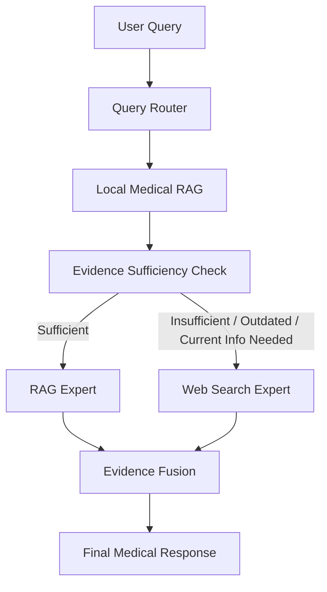

# AdaptMExR-RAG

### Adaptive Multi-Expert Retrieval-Augmented Generation for Medical QA

AdaptMExR-RAG is a research framework for medical question answering that dynamically combines **local medical knowledge** and **web-based evidence** to improve answer quality, safety, and efficiency.

## Architecture

## Key Features

- Adaptive query routing
- Local medical RAG
- Evidence sufficiency checking
- Trusted web-search expert
- Local + web evidence fusion
- Medical safety-aware generation
- Adaptive retrieval and reasoning

## Evaluation Metrics

- Groundedness
- Relevance
- Factuality
- Medical Safety
- Professionalism
- Abstention Accuracy
- Latency
- Token Usage

## Research Objective

AdaptMExR-RAG investigates whether **adaptive multi-expert retrieval and evidence fusion** can improve medical question answering compared with conventional fixed RAG systems.

