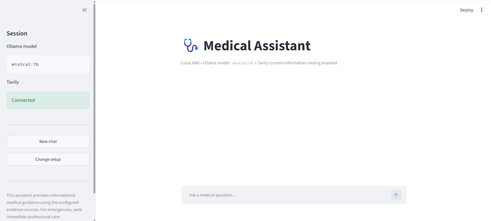
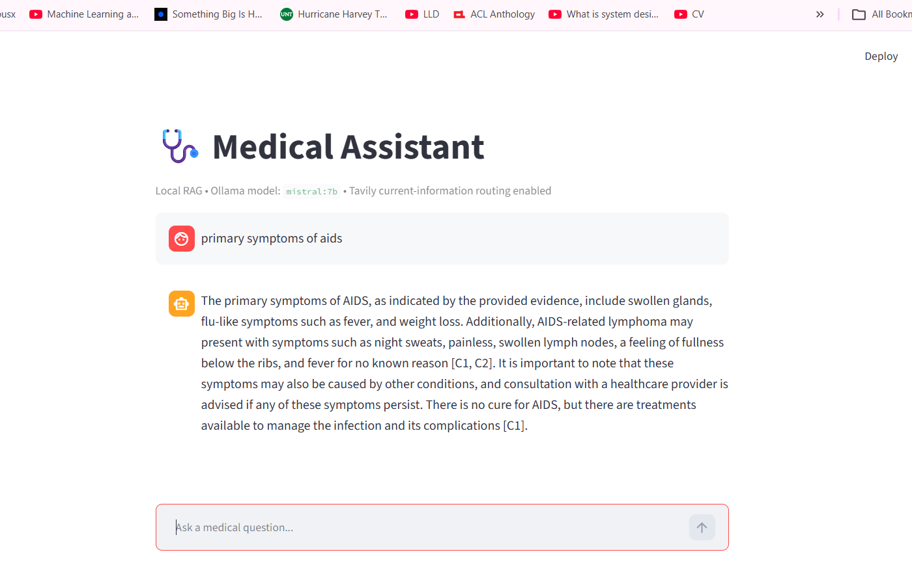

# Local Medical RAG Assistant




This is my local medical RAG assistant built with Ollama, MedCPT, FAISS, BM25, Tavily, and Streamlit.

The main idea is simple: normal medical questions are answered from a local medical knowledge base, while questions that need recent or updated information can use web search. The selected Ollama model runs locally and the app keeps the conversation history during the current session.

The complete application starts with:

```bash
python main.py
```

---

## What It Does

The application can:

- detect whether Ollama is installed and running;
- detect locally installed Ollama models;
- let the user choose which local LLM to use;
- validate a Tavily API key before entering the chat;
- classify medical questions before retrieval;
- retrieve medical evidence using MedCPT + FAISS + BM25;
- combine dense and sparse retrieval with Reciprocal Rank Fusion;
- rerank retrieved evidence with the MedCPT Cross-Encoder;
- use adaptive retrieval depth depending on question difficulty;
- decompose more complex questions into smaller retrieval queries;
- use Tavily for questions that require recent information;
- keep multi-turn chat memory during the Streamlit session;
- check generated answers for grounding, citation validity, professionalism, and privacy;
- perform one repair pass when an answer fails the postcheck.

---

## Example Output



The assistant retrieves evidence from the local knowledge base and generates the answer with evidence IDs such as:

```text
[C1]
[C2]
```

For current web information, the web-search route uses:

```text
[W1]
[W2]
```

---

## How the Pipeline Works

```text
User Question
     |
     v
Query Analyzer
     |
     +----------------------+----------------------+----------------------+
     |                      |                      |                      |
   NORMAL              OLD_RELEVANT         UPDATED_NEED         SAFETY ROUTES
     |                      |                      |                      |
     v                      v                      v                      v
MedCPT Retrieval      Relationship Agent      Tavily Search       Privacy / ER /
     |                      |                      |                Clarification
     |                Query Decomposition          |
     |                      |                      |
     |                 Adaptive Retrieval          |
     |                      |                      |
     +----------------------+----------------------+
                            |
                            v
                      Ollama Generator
                            |
                            v
                        Postcheck
                            |
                   Optional Repair Pass
                            |
                            v
                       Final Answer
```

---

## Local Retrieval Pipeline

The local RAG part uses both dense and sparse retrieval.

```text
Question
   |
   +----> MedCPT Query Encoder ----> FAISS
   |
   +----> BM25
              |
              v
     Reciprocal Rank Fusion
              |
              v
     MedCPT Cross-Encoder
              |
              v
       Final Evidence
```

The current retriever uses:

```text
ncbi/MedCPT-Query-Encoder
ncbi/MedCPT-Cross-Encoder
FAISS
BM25
Reciprocal Rank Fusion
```

---

## Adaptive Retrieval

The number of retrieved chunks is selected according to query difficulty.

| Difficulty | Retrieval Depth |
|---|---:|
| Easy | 3-4 |
| Mid | 5-8 |
| Hard | 9-15 |

Simple questions therefore use a smaller context, while more difficult questions can retrieve more evidence.

---

## Query Routes

The query analyzer can route a question into:

| Route | Purpose |
|---|---|
| `NORMAL` | Standard local medical RAG |
| `AMBIGUOUS` | Ask the user for clarification |
| `CONTRADICTION` | Clarify conflicting information |
| `OLD_RELEVANT` | Use relevant previous medical history |
| `UPDATED_NEED` | Search current information using Tavily |
| `PRIVACY_LEAKAGE` | Block inappropriate third-party medical-data requests |
| `SEVERE_ER` | Give emergency escalation guidance |

---

## Chat Memory

The Streamlit app stores the current conversation in session memory.

For example:

```text
User:
What are the symptoms of diabetes?

Assistant:
...

User:
What about the early symptoms?

Assistant:
...
```

The second question is handled together with the previous conversation instead of being treated as a completely unrelated question.

---

## Small Knowledge-Base Limitation

The current local knowledge base is relatively small.

Because of this, the local vector database will not contain equally strong information for every disease. Rare diseases, less common conditions, newer diseases, or topics that are not represented in the indexed documents may have weak or missing local retrieval results.

To reduce this limitation, the project also has a web-search route.

When a question requires newer or broader information:

```text
Question
   |
   v
UPDATED_NEED
   |
   v
Tavily Search
   |
   v
Web Evidence
   |
   v
Ollama
   |
   v
Final Answer
```

This makes the system more useful when the local knowledge base does not contain enough recent information.

Web search improves coverage, but it does not guarantee that every retrieved source is complete or clinically authoritative.

---

## Repository Structure

The runnable application is inside the `ai_med_rag` directory.

```text
AI_MoE_Med_Assistant/
│
├── .git/
│
├── ai_med_rag/
│   ├── main.py
│   ├── check_project.py
│   ├── requirements.txt
│   │
│   ├── app/
│   │   └── app.py
│   │
│   ├── agents/
│   │   ├── __init__.py
│   │   ├── query_analyzer.py
│   │   ├── relationship.py
│   │   ├── decomposition.py
│   │   └── postcheck.py
│   │
│   ├── models/
│   │   ├── __init__.py
│   │   └── ollama_generator.py
│   │
│   ├── retrieval/
│   │   ├── __init__.py
│   │   └── medcpt_retriever.py
│   │
│   ├── rag/
│   │   ├── __init__.py
│   │   ├── retrieval_pipeline.py
│   │   ├── generator.py
│   │   └── pipeline.py
│   │
│   └── web_search/
│       ├── __init__.py
│       └── tavily_search.py
│
├── assets/
│   ├── main-window.png
│   └── output-result.png
│
├── base_model/
├── evaluations/
├── final_model/
├── questions/
├── vector_db/
│   ├── medquad_medcpt.faiss
│   ├── medquad_metadata.pkl
│   └── medquad_vectorstore_config.json
│
└── README.md
```

---

## Installation

### Clone the Repository

```bash
git clone <your-repository-url>
cd AI_MoE_Med_Assistant
cd ai_med_rag
```

All Python commands for the application should be run from inside:

```text
ai_med_rag/
```

### Create a Virtual Environment

Windows:

```powershell
python -m venv .venv
.venv\Scripts\Activate.ps1
```

Command Prompt:

```bat
python -m venv .venv
.venv\Scripts\activate.bat
```

macOS / Linux:

```bash
python3 -m venv .venv
source .venv/bin/activate
```

### Install Dependencies

```bash
python -m pip install --upgrade pip
pip install -r requirements.txt
```

---

## Install Ollama

Install Ollama first, then check the installation:

```bash
ollama --version
```

Install at least one local model.

For example:

```bash
ollama pull mistral:7b
```

or:

```bash
ollama pull qwen3:8b
```

Check available models:

```bash
ollama list
```

The application will automatically show the installed models in the setup screen.

---

## Tavily API Key

The application asks for a Tavily API key before entering the medical chat.

The key is entered using a password field in Streamlit and is kept in the current application session.

It is used for questions that require current or recently updated information.

---

## Vector Database

The repository-level vector database is:

```text
AI_MoE_Med_Assistant/vector_db/
```

It contains:

```text
medquad_medcpt.faiss
medquad_metadata.pkl
medquad_vectorstore_config.json
```

If your `rag/pipeline.py` currently expects:

```text
ai_med_rag/vector_db/
```

either copy the three files there or update `DEFAULT_VECTOR_DB_DIR` to point to the repository-level `vector_db` folder.

The FAISS index must be queried using the matching MedCPT query encoder because the stored vectors were created in the MedCPT embedding space.

---

## Run the Project

After cloning the repository:

```bash
cd AI_MoE_Med_Assistant
cd ai_med_rag
```

Install dependencies:

```bash
pip install -r requirements.txt
```

Optionally run the project checker:

```bash
python check_project.py
```

Then start the complete application:

```bash
python main.py
```

The browser should open automatically.

If it does not, open:

```text
http://127.0.0.1:8501
```

---

## First Run

The first screen checks the local setup.

The user must:

```text
1. Have Ollama installed
2. Choose an installed Ollama model
3. Enter a Tavily API key
4. Verify the Tavily key
5. Continue to the Medical Assistant
```

If Ollama is missing, the chat screen is blocked.

If no local model is installed, the user must pull a model first.

---

## Main Technologies

| Component | Technology |
|---|---|
| Interface | Streamlit |
| Local LLM Runtime | Ollama |
| Dense Retrieval | MedCPT + FAISS |
| Sparse Retrieval | BM25 |
| Retrieval Fusion | Reciprocal Rank Fusion |
| Reranking | MedCPT Cross-Encoder |
| Web Search | Tavily |
| Chat Memory | Streamlit Session State |
| Generation | User-selected Ollama model |
| Language | Python |

---

## Privacy

The main language-model inference runs locally through Ollama.

The vector database also remains local.

However, questions routed to Tavily are sent to an external web-search service. Therefore, private or identifying medical information should not be included in web-routed queries unless the deployment has been designed and approved for that use.

---

## Medical Use Notice

This is a research and development project.

It is not intended to replace a doctor, diagnosis, treatment, emergency services, or professional medical advice.

The answer quality depends on:

- the selected Ollama model;
- the size and quality of the local knowledge base;
- retrieval quality;
- Tavily search results;
- model reasoning quality;
- the postcheck pipeline.

The current local knowledge base is small, so disease coverage is not complete.

---

## Future Work

Some improvements I plan to explore:

- larger medical knowledge base;
- better source filtering for web retrieval;
- document-level source display in the UI;
- doctor / healthcare-worker / patient modes;
- persistent encrypted memory;
- additional safety evaluation;
- medical knowledge-graph integration;
- retrieval confidence display;
- model benchmarking;
- evaluation dashboard.

---

## License

This project is licensed under the MIT License.

See the [LICENSE](LICENSE) file for details.

